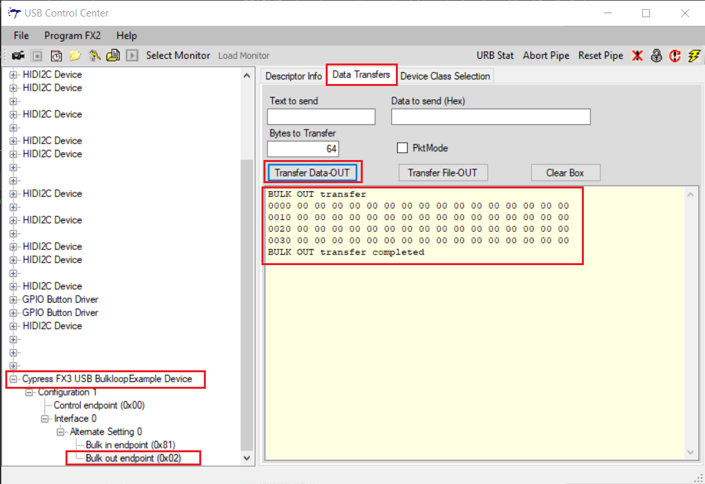
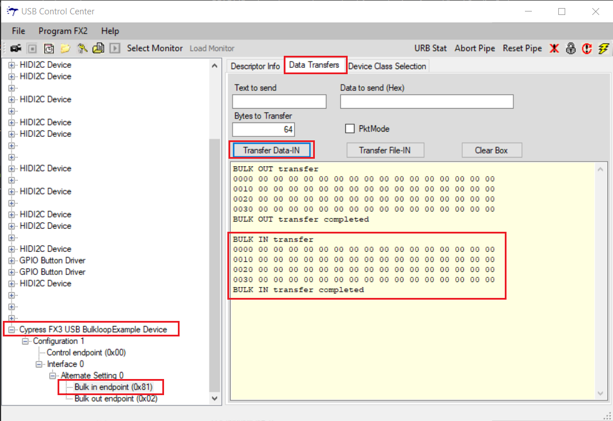
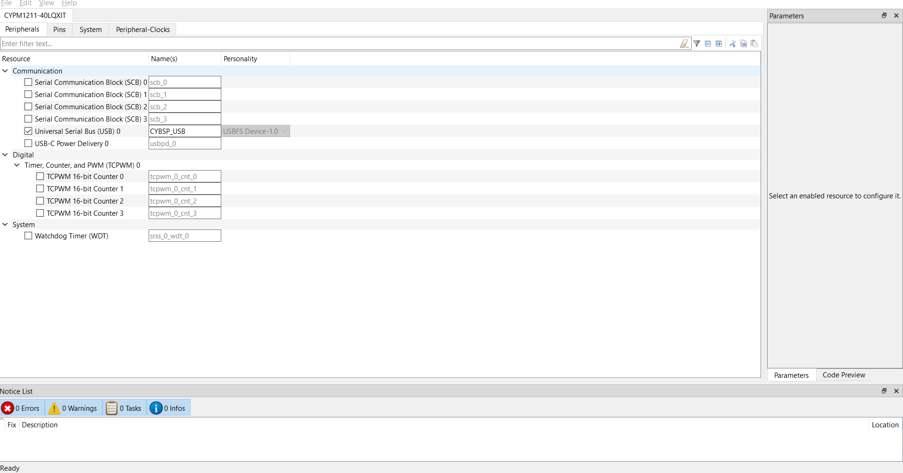
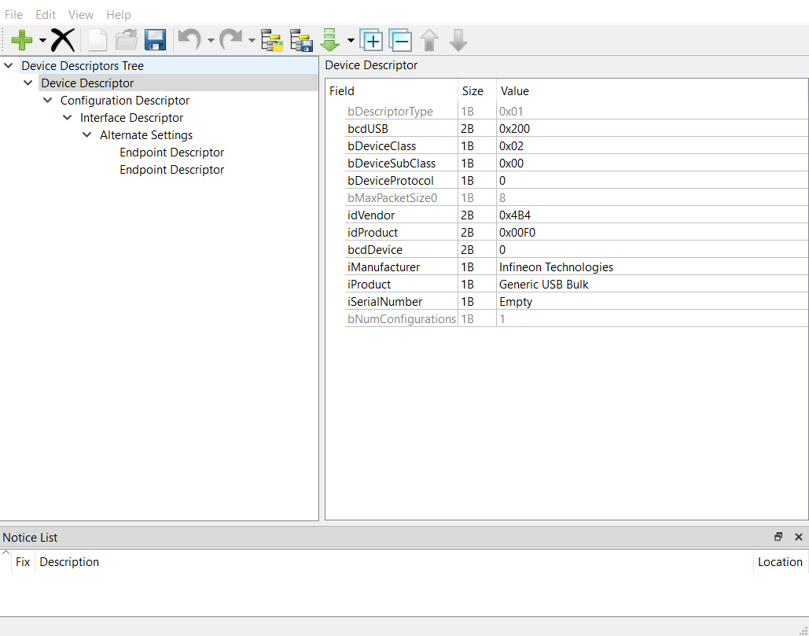
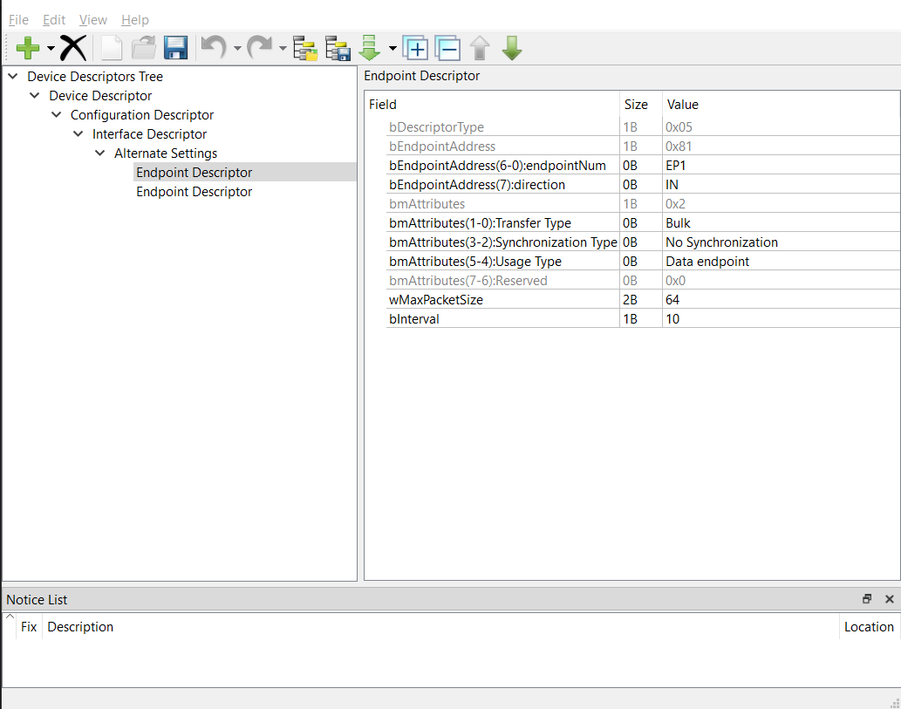
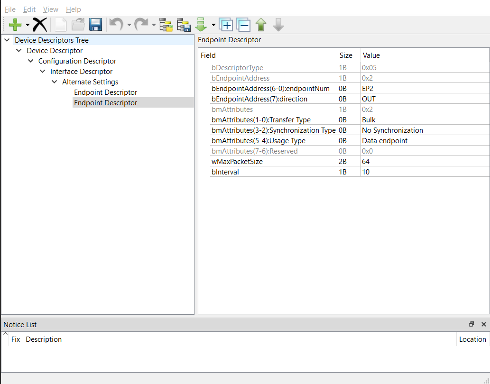

# EZ-PD™ PMG1 MCU: USB FS vendor interface

This code example demonstrates how to configure the USB block on EZ-PD&trade; PMG1 MCU as a vendor interface. When configured for vendor interface, the EZ-PD&trade; PMG1 MCU device enumerates as Cypress FX3 USB BulkloopExample Device, which can be read and written using a USB Control Center on a PC.

[View this README on GitHub.](https://github.com/Infineon/mtb-example-pmg1-usbfs-vendor-interface)

[Provide feedback on this code example.](https://github.com/Infineon/mtb-example-pmg1-usbfs-vendor-interface)


## Requirements

- [ModusToolbox™ software](https://www.infineon.com/cms/en/design-support/tools/sdk/modustoolbox-software)
v2.4 or later (tested with v2.4)
- Set the `CY_SUPPORTED_KITS` environment variable with the value of "PMG1" to enable support for the EZ-PD&trade; PMG1 parts and BSPs under ModusToolbox&trade; software
- Board support package (BSP) minimum required version: 2.0.0
- Programming language: C
- Associated parts: [EZ-PD&trade; PMG1-S2 MCU](https://www.infineon.com/cms/en/product/evaluation-boards/cy7112/?utm_source=cypress&utm_medium=referral&utm_campaign=202110_globe_en_all_integration-dev_kit) and [EZ-PD&trade; PMG1-S3 MCU](https://www.infineon.com/cms/en/product/evaluation-boards/cy7113/?utm_source=cypress&utm_medium=referral&utm_campaign=202110_globe_en_all_integration-dev_kit)

## Supported toolchains (make variable 'TOOLCHAIN')

- GNU Arm® embedded compiler v9.3.1 (`GCC_ARM`) - Default value of `TOOLCHAIN`
- Arm&reg; compiler v6.13 (`ARM`)
- IAR C/C++ compiler v8.42.2 (`IAR`)

## Supported kits (make variable 'TARGET')

- [EZ-PD&trade; PMG1-S2 MCU prototyping kit](https://www.infineon.com/cms/en/product/evaluation-boards/cy7112/?utm_source=cypress&utm_medium=referral&utm_campaign=202110_globe_en_all_integration-dev_kit) (`PMG1-CY7112`) - Default value of `TARGET`
- [EZ-PD&trade; PMG1-S3 MCU prototyping kit](https://www.infineon.com/cms/en/product/evaluation-boards/cy7113/?utm_source=cypress&utm_medium=referral&utm_campaign=202110_globe_en_all_integration-dev_kit) (`PMG1-CY7113`)

## Hardware setup

See the kit user guide to ensure that the board is configured correctly.

Connect the EZ-PD&trade; PMG1 MCU kit to your PC using a USB-C cable through the KitProg3 USB Type-C port (J1).

## Software setup

Install the following softwares:

- [SuiteUSB 3.4](https://www.infineon.com/cms/en/design-support/tools/sdk/usb-controllers-sdk/suiteusb-3.4-usb-development-tools-for-visual-studio/?utm_source=cypress&utm_medium=referral&utm_campaign=202110_globe_en_all_integration-software): USB Control Center

- [Driver](https://www.infineon.com/dgdl/Infineon-CypressDriverInstaller_1.exe-DevelopmentTools-v01_00-EN.htm?fileId=8ac78c8c7d507547017d5388b600042b): USB vendor class driver

## Using the code example

Create the project and open it using one of the following:

<details><summary><b>In Eclipse IDE for ModusToolbox&trade; software</b></summary>

1. Click the **New Application** link in the **Quick Panel** (or, use **File** > **New** > **ModusToolbox Application**). This launches the [Project Creator](https://www.infineon.com/dgdl/Infineon-ModusToolbox_Project_Creator_Guide_3-UserManual-v01_00-EN.pdf?fileId=8ac78c8c7d718a49017d99bcabbd31e5&utm_source=cypress&utm_medium=referral&utm_campaign=202110_globe_en_all_integration-files) tool.

2. Pick a kit supported by the code example from the list shown in the **Project Creator - Choose Board Support Package (BSP)** dialog.

   When you select a supported kit, the example is reconfigured automatically to work with the kit. To work with a different supported kit later, use the [Library Manager](https://www.infineon.com/dgdl/Infineon-ModusToolbox_Library_Manager_User_Guide_3-UserManual-v01_00-EN.pdf?fileId=8ac78c8c7d718a49017d99ab34b831ce&utm_source=cypress&utm_medium=referral&utm_campaign=202110_globe_en_all_integration-files) to choose the BSP for the supported kit. You can use the Library Manager to select or update the BSP and firmware libraries used in this application. To access the Library Manager, click the link from the **Quick Panel**.

   You can also just start the application creation process again and select a different kit.

   If you want to use the application for a kit not listed here, you may need to update the source files. If the kit does not have the required resources, the application may not work.

3. In the **Project Creator - Select Application** dialog, choose the example by enabling the checkbox.

4. (Optional) Change the suggested **New Application Name**.

5. The **Application(s) Root Path** defaults to the Eclipse workspace which is usually the desired location for the application. If you want to store the application in a different location, you can change the *Application(s) Root Path* value. Applications that share libraries should be in the same root path.

6. Click **Create** to complete the application creation process.

For more details, see the [Eclipse IDE for ModusToolbox&trade; software user guide](https://www.infineon.com/dgdl/Infineon-Eclipse_IDE_for_ModusToolbox_User_Guide_1-UserManual-v01_00-EN.pdf?fileId=8ac78c8c7d718a49017d99bcb86331e8&utm_source=cypress&utm_medium=referral&utm_campaign=202110_globe_en_all_integration-files) (locally available at *{ModusToolbox&trade; software install directory}/ide_{version}/docs/mt_ide_user_guide.pdf*).

</details>

<details><summary><b>In command-line interface (CLI)</b></summary>

ModusToolbox&trade; software provides the Project Creator as both a GUI tool and the command line tool, "project-creator-cli". The CLI tool can be used to create applications from a CLI terminal or from within batch files or shell scripts. This tool is available in the *{ModusToolbox&trade; software install directory}/tools_{version}/project-creator/* directory.

Use a CLI terminal to invoke the "project-creator-cli" tool. On Windows, use the command line "modus-shell" program provided in the ModusToolbox&trade; software installation instead of a standard Windows command-line application. This shell provides access to all ModusToolbox&trade; software tools. You can access it by typing `modus-shell` in the search box in the Windows menu. In Linux and macOS, you can use any terminal application.

This tool has the following arguments:

Argument | Description | Required/optional
---------|-------------|-----------
`--board-id` | Defined in the `<id>` field of the [BSP](https://github.com/Infineon?q=bsp-manifest&type=&language=&sort=) manifest | Required
`--app-id`   | Defined in the `<id>` field of the [CE](https://github.com/Infineon?q=ce-manifest&type=&language=&sort=) manifest | Required
`--target-dir`| Specify the directory in which the application is to be created if you prefer not to use the default current working directory | Optional
`--user-app-name`| Specify the name of the application if you prefer to have a name other than the example's default name | Optional

<br>

The following example will clone the "[USBFS vendor interface](https://github.com/Infineon/mtb-example-pmg1-usbfs-vendor-interface)" application with the desired name "USBFSVendorInterface" configured for the *PMG1-CY7112* BSP into the specified working directory, *C:/mtb_projects*:

   ```
   project-creator-cli --board-id PMG1-CY7112 --app-id mtb-example-pmg1-usbfs-vendor-interface --user-app-name USBFSVendorInterface --target-dir "C:/mtb_projects"
   ```

**Note:** The project-creator-cli tool uses the `git clone` and `make getlibs` commands to fetch the repository and import the required libraries. For details, see the "Project creator tools" section of the [ModusToolbox&trade; software user guide](https://www.cypress.com/ModusToolboxUserGuide) (locally available at *{ModusToolbox&trade; software install directory}/docs_{version}/mtb_user_guide.pdf*).

</details>

<details><summary><b>In third-party IDEs</b></summary>

Use one of the following options:

- **Use the standalone [Project Creator](https://www.infineon.com/dgdl/Infineon-ModusToolbox_Project_Creator_Guide_3-UserManual-v01_00-EN.pdf?fileId=8ac78c8c7d718a49017d99bcabbd31e5&utm_source=cypress&utm_medium=referral&utm_campaign=202110_globe_en_all_integration-files) tool:**

   1. Launch Project Creator from the Windows Start menu or from *{ModusToolbox&trade; software install directory}/tools_{version}/project-creator/project-creator.exe*.

   2. In the initial **Choose Board Support Package** screen, select the BSP, and click **Next**.

   3. In the **Select Application** screen, select the appropriate IDE from the **Target IDE** drop-down menu.

   4. Click **Create** and follow the instructions printed in the bottom pane to import or open the exported project in the respective IDE.

<br>

- **Use command-line interface (CLI):**

   1. Follow the instructions from the **In command-line interface (CLI)** section to create the application, and then import the libraries using the `make getlibs` command.

   2. Export the application to a supported IDE using the `make <ide>` command.

   3. Follow the instructions displayed in the terminal to create or import the application as an IDE project.

For a list of supported IDEs and more details, see the "Exporting to IDEs" section of the [ModusToolbox&trade; software user guide](https://www.infineon.com/dgdl/Infineon-ModusToolbox_2.4_User_Guide-Software-v01_00-EN.pdf?fileId=8ac78c8c7e7124d1017ed97e72563632&utm_source=cypress&utm_medium=referral&utm_campaign=202110_globe_en_all_integration-files) (locally available at *{ModusToolbox&trade; software install directory}/docs_{version}/mtb_user_guide.pdf*).

</details>


## Operation

1. Ensure that the steps listed in the [Hardware setup](#hardware-setup) section are completed.

2. Ensure that the jumper shunt on the power selection jumper (J5) is placed at positions 2-3 to enable programming.

3. Program the board using one of the following:

   <details><summary><b>Using Eclipse IDE for ModusToolbox&trade; software</b></summary>

      1. Select the application project in the Project Explorer.

      2. In the **Quick Panel**, scroll down, and click **\<Application Name> Program (KitProg3_MiniProg4)**.
   </details>

   <details><summary><b>Using CLI</b></summary>

     From the terminal, execute the `make program` command to build and program the application using the default toolchain to the default target. The default toolchain and target are specified in the application's Makefile but you can override those values manually:
      ```
      make program TARGET=<BSP> TOOLCHAIN=<toolchain>
      ```

      Example:
      ```
      make program TARGET=PMG1-CY7112 TOOLCHAIN=GCC_ARM
      ```
</details>

4. After programming the kit, disconnect the USB cable and change the position on the power selection jumper (J5) to 1-2 to power the kit through the EZ-PD&trade; PMG1 USB PD sink port (J10).

5. Connect the EZ-PD&trade; PMG1 MCU kit to the PC using a USB cable through the EZ-PD&trade; PMG1 USB PD sink port (J10).

6. On the PC, verify that a new USB device was enumerated as a Cypress FX3 USB BulkloopExample Device.

**Figure 1. Device Manager - Universal Serial Bus controllers**


7. Run the USB Control Center program and select Cypress FX3 USB BulkloopExample Device->Configration 1->Interface 0->Alternate Setting 0->Bulk Out endpoint(0x02) and select the Data Transfer tab and then click the Transfer Data-OUT button, you can see message below Transfer Data-OUT button "BULK OUT transfer completed".

**Figure 2. USB Control Center - Bulk Out**



8. Receive the same data select Cypress FX3 USB BulkloopExample Device->Configration 1->Interface 0->Alternate Setting 0->Bulk In endpoint(0x81) and select the Data Transfer tab and then click the Transfer Data-IN. You can see the "BULK IN transfer completed" message as shown in Figure 3.

**Figure 3. USB Control Center - Bulk In**



**Note:** This example has only one 64-byte buffer allocated to receive data from the host. Any additional data transfered will overwrite the previous data with the new data.


## Debugging

You can debug the example to step through the code. In the IDE, use the **\<Application Name> Debug (KitProg3_MiniProg4)** configuration in the **Quick Panel**. For details, see the "Program and debug" section in the [Eclipse IDE for ModusToolbox&trade; software user guide](https://www.infineon.com/dgdl/Infineon-Eclipse_IDE_for_ModusToolbox_User_Guide_1-UserManual-v01_00-EN.pdf).


## Design and implementation

In the main firmware routine, the USB device block is configured to use the vendor class. After enumeration, the device constantly checks if any data received from the host. If any data is available, the application sends the same data back to the host.

### Device configuration

To view the vendor descriptor:

1. Select the application project in the **Project Explorer**.

2. In the **Quick Panel** select **Tools** and click **Device Configurator 3.10**.

3. In Peripherals, select the **Universal Serial Bus (USB) 0** to view the USB configuration fields as shown in the following figure. Note that the USB Peripheral personality is set as **USBFS Device-1.0**.

**Figure 4. Universal Serial Bus (USB) 0 configuration using Device Configurator 3.10**



### USB configuration

1. Select the application project in the **Project Explorer**.

2. In the **Quick Panel** select **Tools** and click **USB Configurator 2.4**.

3. Some of the descriptor configurations are shown in the following figures.


**Figure 5. USBCDC device descriptor**



   **Alternate settings**
   - bDeviceClass:  Names the device class
   - 0x02: This value indicates that the device is a communications device

**Figure 6. USB IN data endpoint descriptor**




   **Endpoint descriptors**

   - The two endpoint descriptors act as buffers storing the received data or data waiting to be transmitted.

   - The **bEndpointAddress(7):direction** is an important field in the endpoint descriptors. The endpoint is defined as IN and provides the data to send to the host while another endpoint is defined as OUT and stores data received from the host.


**Figure 7. USB OUT data endpoint descriptor**




### Resources and settings

**Table 1. Application resources**

Resource  |  Alias/object     |    Purpose
:------- | :------------    | :------------
USB | CYBSP_USB  | USB device configured with vendor class descriptor

<br>

## Related resources

Resources | Links
-----------|------------------
Application notes |[AN232553](https://www.infineon.com/dgdl/Infineon-AN232553_Getting_started_with_EZ-PD_PMG1_MCU_on_ModusToolbox_software-ApplicationNotes-v02_00-EN.pdf?fileId=8ac78c8c7cdc391c017d0d3e98ed67ea&utm_source=cypress&utm_medium=referral&utm_campaign=202110_globe_en_all_integration-application_note) – Getting started with EZ-PD&trade; PMG1 MCU on ModusToolbox&trade; software <br> [AN232565](https://www.infineon.com/dgdl/Infineon-AN232565_EZ-PD_PMG1_MCU_hardware_design_guidelines_and_checklist-ApplicationNotes-v02_00-EN.pdf?fileId=8ac78c8c7cdc391c017d0d3ea58367f2&utm_source=cypress&utm_medium=referral&utm_campaign=202110_globe_en_all_integration-application_note) – EZ-PD&trade; PMG1 MCU hardware design guidelines and checklist
Code examples | [Using ModusToolbox&trade; software](https://github.com/infineon?q=mtb-example-pmg1%20NOT%20Deprecated) on GitHub
Device documentation | [EZ-PD&trade; PMG1 datasheets](https://www.infineon.com/cms/en/product/universal-serial-bus-usb-power-delivery-controller/usb-c-and-power-delivery/ez-pd-pmg1-portfolio-high-voltage-mcus-usb-c-power-delivery/?utm_source=cypress&utm_medium=referral&utm_campaign=202110_globe_en_all_integration-product_families#!documents)
Development kits | Select your kits from the [Evaluation Board Finder](https://www.infineon.com/cms/en/design-support/finder-selection-tools/product-finder/evaluation-board) page.
Libraries on GitHub | [mtb-pdl-cat2](https://github.com/Infineon/mtb-pdl-cat2) – Peripheral driver library (PDL) and docs <br> [mtb-hal-cat2](https://github.com/Infineon/mtb-hal-cat2) – Hardware abstraction layer (HAL) library and docs
Tools | [Eclipse IDE for ModusToolbox&trade; software](https://www.infineon.com/modustoolbox) – ModusToolbox&trade; software is a collection of easy-to-use software and tools enabling rapid development with Infineon MCUs, covering applications from embedded sense and control to wireless and cloud-connected systems using AIROC™ Wi-Fi & Bluetooth® combo devices.

## Other resources

Infineon provides a wealth of data at www.infineon.com to help you select the right device, and quickly and effectively integrate it into your design.

## Document history

Document title: *CE235058* – *EZ-PD&trade; PMG1 MCU: USBFS vendor interface*

Version | Description of change
------- | ---------------------
1.0.0   | New code example


<br>

---------------------------------------------------------

© Cypress Semiconductor Corporation, 2022. This document is the property of Cypress Semiconductor Corporation, an Infineon Technologies company, and its affiliates ("Cypress").  This document, including any software or firmware included or referenced in this document ("Software"), is owned by Cypress under the intellectual property laws and treaties of the United States and other countries worldwide.  Cypress reserves all rights under such laws and treaties and does not, except as specifically stated in this paragraph, grant any license under its patents, copyrights, trademarks, or other intellectual property rights.  If the Software is not accompanied by a license agreement and you do not otherwise have a written agreement with Cypress governing the use of the Software, then Cypress hereby grants you a personal, non-exclusive, nontransferable license (without the right to sublicense) (1) under its copyright rights in the Software (a) for Software provided in source code form, to modify and reproduce the Software solely for use with Cypress hardware products, only internally within your organization, and (b) to distribute the Software in binary code form externally to end users (either directly or indirectly through resellers and distributors), solely for use on Cypress hardware product units, and (2) under those claims of Cypress’s patents that are infringed by the Software (as provided by Cypress, unmodified) to make, use, distribute, and import the Software solely for use with Cypress hardware products.  Any other use, reproduction, modification, translation, or compilation of the Software is prohibited.
<br>
TO THE EXTENT PERMITTED BY APPLICABLE LAW, CYPRESS MAKES NO WARRANTY OF ANY KIND, EXPRESS OR IMPLIED, WITH REGARD TO THIS DOCUMENT OR ANY SOFTWARE OR ACCOMPANYING HARDWARE, INCLUDING, BUT NOT LIMITED TO, THE IMPLIED WARRANTIES OF MERCHANTABILITY AND FITNESS FOR A PARTICULAR PURPOSE.  No computing device can be absolutely secure.  Therefore, despite security measures implemented in Cypress hardware or software products, Cypress shall have no liability arising out of any security breach, such as unauthorized access to or use of a Cypress product. CYPRESS DOES NOT REPRESENT, WARRANT, OR GUARANTEE THAT CYPRESS PRODUCTS, OR SYSTEMS CREATED USING CYPRESS PRODUCTS, WILL BE FREE FROM CORRUPTION, ATTACK, VIRUSES, INTERFERENCE, HACKING, DATA LOSS OR THEFT, OR OTHER SECURITY INTRUSION (collectively, "Security Breach").  Cypress disclaims any liability relating to any Security Breach, and you shall and hereby do release Cypress from any claim, damage, or other liability arising from any Security Breach.  In addition, the products described in these materials may contain design defects or errors known as errata which may cause the product to deviate from published specifications. To the extent permitted by applicable law, Cypress reserves the right to make changes to this document without further notice. Cypress does not assume any liability arising out of the application or use of any product or circuit described in this document. Any information provided in this document, including any sample design information or programming code, is provided only for reference purposes.  It is the responsibility of the user of this document to properly design, program, and test the functionality and safety of any application made of this information and any resulting product.  "High-Risk Device" means any device or system whose failure could cause personal injury, death, or property damage.  Examples of High-Risk Devices are weapons, nuclear installations, surgical implants, and other medical devices.  "Critical Component" means any component of a High-Risk Device whose failure to perform can be reasonably expected to cause, directly or indirectly, the failure of the High-Risk Device, or to affect its safety or effectiveness.  Cypress is not liable, in whole or in part, and you shall and hereby do release Cypress from any claim, damage, or other liability arising from any use of a Cypress product as a Critical Component in a High-Risk Device. You shall indemnify and hold Cypress, including its affiliates, and its directors, officers, employees, agents, distributors, and assigns harmless from and against all claims, costs, damages, and expenses, arising out of any claim, including claims for product liability, personal injury or death, or property damage arising from any use of a Cypress product as a Critical Component in a High-Risk Device. Cypress products are not intended or authorized for use as a Critical Component in any High-Risk Device except to the limited extent that (i) Cypress’s published data sheet for the product explicitly states Cypress has qualified the product for use in a specific High-Risk Device, or (ii) Cypress has given you advance written authorization to use the product as a Critical Component in the specific High-Risk Device and you have signed a separate indemnification agreement.
<br>
Cypress, the Cypress logo, and combinations thereof, WICED, ModusToolbox, PSoC, CapSense, EZ-USB, F-RAM, and Traveo are trademarks or registered trademarks of Cypress or a subsidiary of Cypress in the United States or in other countries. For a more complete list of Cypress trademarks, visit cypress.com. Other names and brands may be claimed as property of their respective owners.
